# Katta Terraform

[](https://github.com/shift7-ch/katta-terraform/actions/workflows/terraform-validate.yml)

> [Katta](https://katta.cloud/): transform your S3 storage into a secure, team-friendly workspace with client-side encryption.

Set up [Katta Server](https://github.com/shift7-ch/katta-server) in a custom AWS-hosted zone using [Terraform workflow for provisioning infrastructure](https://developer.hashicorp.com/terraform/cli/run).

## Prerequisites

1. Register a domain `<dns_suffix>` such as `example.net` in AWS Route53 to be used. A subdomain `hub.katta.example.net` and
   `keycloak.katta.example.net` will be created for the Katta deployment when applying Terraform.

2. Install [Docker](https://docs.docker.com/desktop/setup/install/mac-install/).

3. Setup [AWS CLI](https://docs.aws.amazon.com/cli/latest/userguide/getting-started-install.html) and configure credentials in environment:
    ```shell
    export AWS_ACCESS_KEY_ID=
    export AWS_SECRET_ACCESS_KEY=
    export AWS_SESSION_TOKEN=
    export AWS_DEFAULT_REGION=
    export AWS_USE_DUALSTACK_ENDPOINT=false
    ```

## Deployment

1. Setup Terraform Workspace
    ```shell
    terraform workspace new katta
    ```
   The workspace name determines the infix `<workspace>` in the subdomains created:

    * `https://hub.<workspace>.<dns_suffix>`
    * `https://keycloak.<workspace>.<dns_suffix>`

2. Override default Terraform configuration

   Defaults can be found in `terraform.tfvars.template`. Either copy to `terraform.tfvars` (not under version control)
   or overridden by environment variables:

    ```shell
    export TF_VAR_region=$AWS_DEFAULT_REGION
    export TF_VAR_dns_suffix=example.net
    export TF_VAR_keycloak_db_password=
    export TF_VAR_keycloak_admin_password=
    export TF_VAR_hub_db_password=
    export TF_VAR_hub_admin_password=
    export TF_VAR_hub_keycloak_system_client_secret=top-secret
    export TF_VAR_hub_keycloak_oidc_cryptomator_vaults_client_secret=top-secret
    # optional initial license and matching Hub ID, defaults to the shared test license
    export TF_VAR_hub_initial_license=
    export TF_VAR_hub_initial_id=
    ```
3. Add hosted zone for domain in AWS Route53 if missing:

    ```shell
    aws route53 create-hosted-zone --name $TF_VAR_dns_suffix --caller-reference $(date +%s)
    ```

   **Warning**: For domain validation to work in AWS Certificate Manager, you must ensure the name servers set in the
   hosted zone match the name servers set in the Route53 domain registration.

4. Add GitHub Personal Access Token

    - AWS ECR pull-through cache requires authentication even for public GitHub Container Registry repositories.
    - Create a GitHub Personal Access Token with `read:packages` permission using `gh` CLI:

   ```shell
   # Create a new token specifically for this:
   gh auth login --scopes read:packages
   ```

    - Then add the token to environment:

   ```shell
   export TF_VAR_github_token=$(gh auth token)
   ```

   Alternatively, create manually via GitHub web UI:
    - Go to GitHub Settings → Developer settings → Personal access tokens → Tokens (classic)
    - Generate new token with `read:packages` scope
    - Add to `terraform.tfvars`: `github_token = "ghp_your_token_here"`

5. Validate environment

    ```shell
    terraform init
    terraform validate
    terraform plan
    ```

6. Deploy environment

    ```shell
    terraform apply --auto-approve
    ```

7. Log in via Web Browser

* Open `https://hub.<workspace>.<dns_suffix>` in browser to log in to _Katta Hub_ with the admin user (default `admin`)
  and password as `$TF_VAR_hub_admin_password`. You must change the password on first login.
* Open `https://keycloak.<workspace>.<dns_suffix>` in browser to log in to _Katta Keycloak_ with the admin user (default
  `keycloak_admin`) and password as `$TF_VAR_keycloak_admin_password`.

## Cleanup

Preconditions from leftovers previous run: Rename secret names, they have a minimum grace period of 7 days before
deletion.

1. Destroy environment
    ```shell
    terraform destroy --auto-approve
    ```

## Background

### ECR Pull-Through Cache

Container images are automatically pulled from GitHub Container Registry (ghcr.io) via Amazon ECR pull-through cache
rules. This eliminates the need to manually pull and push images to ECR.

- Keycloak: see `keycloak_version` in [variables.tf](variables.tf)
- Katta Hub: see `hub_version` in [variables.tf](variables.tf)

Images are cached in ECR with the prefix `<workspace>-ghcr/` and pulled automatically when ECS tasks start.

## Differences to k8s setup

- no URL paths `/kc` for Keycloak and `/<realm>/` for hub instances
- non-shared Keycloak
- realm rendered with the Helm provider from the realm template
  `_realm.tpl` of the
  Katta Server Helm chart from [katta-helm](https://github.com/shift7-ch/katta-helm) in version `katta_chart_version`
  (defaults to `^1` for the latest version of major version 1, set an exact version for reproducible deployments or
  `null` for the latest version). Secrets are rendered as placeholders `HUB_ADMIN_PASSWORD`,
  `HUB_KEYCLOAK_SYSTEM_CLIENT_SECRET` and `HUB_KEYCLOAK_OIDC_CRYPTOMATOR_VAULTS_CLIENT_SECRET`, which Keycloak resolves on
  import from Secrets Manager.

## Troubleshooting

### Wait for ACM validation

```
aws_acm_certificate_validation.keycloak_cert_validation: Still creating... [4m41s elapsed]
aws_acm_certificate_validation.hub_cert_validation: Still creating... [4m40s elapsed]
```

Ensure the name server entries for the [hosted zone](#deployment) match the name servers in the domain registration in Route 53.

### Tail Logs

```shell
aws logs tail `terraform workspace show`-hub-log-group --output text --since 30s --follow
aws logs tail `terraform workspace show`-keycloak-log-group --output text --since 30s --follow
```

### Debug ECS tasks

Enable execute command with variable `ecs_enable_execute_command`.

```shell
# TF_VAR_region
WORKSPACE=$(terraform workspace show)
# inspect services
aws ecs describe-services --region ${TF_VAR_region} --cluster ${WORKSPACE}-cluster --service ${WORKSPACE}-keycloak-ecs-service
aws ecs describe-services --region ${TF_VAR_region} --cluster ${WORKSPACE}-cluster --service ${WORKSPACE}-hub-ecs-service
# list task
aws ecs list-tasks --region ${TF_VAR_region} --cluster ${WORKSPACE}-cluster
#{
#    "taskArns": [
#        "arn:aws:ecs:<region>:<account ID>:task/che-cluster/8bd3030e916a47e08cd579bc70009737",
#        "arn:aws:ecs:<region>:<account ID>:task/che-cluster/fb33d05b480f4cc19cb4299190b916d5"
#    ]
#}
# inspect tasks
aws ecs describe-tasks --region ${TF_VAR_region} --cluster ${WORKSPACE}-cluster --task 8bd3030e916a47e08cd579bc70009737 
aws ecs describe-tasks --region ${TF_VAR_region} --cluster ${WORKSPACE}-cluster --task fb33d05b480f4cc19cb4299190b916d5 
# debug containers:
aws ecs execute-command \
--region ${TF_VAR_region} \
--cluster ${WORKSPACE}-cluster \
--task fb33d05b480f4cc19cb4299190b916d5 \
--container ${WORKSPACE}-container-keycloak \
--interactive \
--command "/bin/sh"
aws ecs execute-command \
--region ${TF_VAR_region} \
--cluster ${WORKSPACE}-cluster \
--task 8bd3030e916a47e08cd579bc70009737 \
--container ${WORKSPACE}-container-hub \
--interactive \
--command "/bin/sh"
```

## Resources

Initial terraform script from [source](https://github.com/metronom72/keycloak_deployment/tree/main/infra).

## Architecture

Generated with [Terramaid](https://github.com/RoseSecurity/Terramaid):

```shell
terramaid run -s "Overview" --exclude-types "aws_iam_*" --exclude-types "aws_security_group" --exclude-types "aws_secretsmanager_*" --exclude-types "aws_appautoscaling_*" --exclude-types "aws_cloudwatch_*" --exclude-types "aws_acm*" --exclude-types "null*" --exclude-types "aws_route53*"
terramaid run -s "Security Groups" --include-types "aws_security_group" --include-types "aws_db_instance" --include-types "aws_ecs_*" --include-types "aws_lb" --include-types "aws_vpc_endpoint" --include-types "aws_ecs_cluster" --include-types "aws_vpc"
```

### Overview

```mermaid
flowchart TD
   subgraph Overview
      data_aws_availability_zones_available["data.aws_availability_zones.available"]
      data_aws_caller_identity_current["data.aws_caller_identity.current"]
      data_helm_template_katta_server["data.helm_template.katta_server"]
      aws_db_instance_hub_db["aws_db_instance.hub_db"]
      aws_db_instance_postgres["aws_db_instance.postgres"]
      aws_db_subnet_group_private_subnet_group["aws_db_subnet_group.private_subnet_group"]
      aws_ecr_pull_through_cache_rule_github["aws_ecr_pull_through_cache_rule.github"]
      aws_ecs_cluster_katta_ecs_cluster["aws_ecs_cluster.katta_ecs_cluster"]
      aws_ecs_service_katta_server_ecs_service["aws_ecs_service.katta_server_ecs_service"]
      aws_ecs_service_keycloak_ecs_service["aws_ecs_service.keycloak_ecs_service"]
      aws_ecs_task_definition_katta_server_ecs_task["aws_ecs_task_definition.katta_server_ecs_task"]
      aws_ecs_task_definition_keycloak_ecs_task["aws_ecs_task_definition.keycloak_ecs_task"]
      aws_eip_nat["aws_eip.nat"]
      aws_internet_gateway_public_igw["aws_internet_gateway.public_igw"]
      aws_lb_hub_public_alb["aws_lb.hub_public_alb"]
      aws_lb_keycloak_public_alb["aws_lb.keycloak_public_alb"]
      aws_lb_listener_hub_http_listener["aws_lb_listener.hub_http_listener"]
      aws_lb_listener_hub_https_listener["aws_lb_listener.hub_https_listener"]
      aws_lb_listener_keycloak_http_listener["aws_lb_listener.keycloak_http_listener"]
      aws_lb_listener_keycloak_https_listener["aws_lb_listener.keycloak_https_listener"]
      aws_lb_target_group_hub_ecs_target_group["aws_lb_target_group.hub_ecs_target_group"]
      aws_lb_target_group_keycloak_ecs_target_group["aws_lb_target_group.keycloak_ecs_target_group"]
      aws_nat_gateway_private_nat["aws_nat_gateway.private_nat"]
      aws_route_internet_access["aws_route.internet_access"]
      aws_route_table_private_subnet["aws_route_table.private_subnet"]
      aws_route_table_public_subnet["aws_route_table.public_subnet"]
      aws_route_table_association_private_subnets["aws_route_table_association.private_subnets"]
      aws_route_table_association_public_subnets["aws_route_table_association.public_subnets"]
      aws_service_discovery_http_namespace_katta_service_connect["aws_service_discovery_http_namespace.katta_service_connect"]
      aws_subnet_private["aws_subnet.private"]
      aws_subnet_public["aws_subnet.public"]
      aws_vpc_katta["aws_vpc.katta"]
      aws_vpc_endpoint_ecr_api["aws_vpc_endpoint.ecr_api"]
      aws_vpc_endpoint_ecr_dkr["aws_vpc_endpoint.ecr_dkr"]
      aws_vpc_endpoint_ecr_logs["aws_vpc_endpoint.ecr_logs"]
      aws_vpc_endpoint_ecr_secretsmanager["aws_vpc_endpoint.ecr_secretsmanager"]
      random_id_secret_suffix["random_id.secret_suffix"]
   end
   aws_db_instance_hub_db --> aws_db_subnet_group_private_subnet_group
   aws_db_instance_postgres --> aws_db_subnet_group_private_subnet_group
   aws_db_subnet_group_private_subnet_group --> aws_subnet_private
   aws_ecs_cluster_katta_ecs_cluster --> aws_service_discovery_http_namespace_katta_service_connect
   aws_ecs_service_katta_server_ecs_service --> aws_ecs_task_definition_katta_server_ecs_task
   aws_ecs_service_katta_server_ecs_service --> aws_lb_target_group_hub_ecs_target_group
   aws_ecs_service_keycloak_ecs_service --> aws_ecs_cluster_katta_ecs_cluster
   aws_ecs_service_keycloak_ecs_service --> aws_ecs_task_definition_keycloak_ecs_task
   aws_ecs_service_keycloak_ecs_service --> aws_lb_target_group_keycloak_ecs_target_group
   aws_ecs_task_definition_katta_server_ecs_task --> aws_db_instance_hub_db
   aws_ecs_task_definition_katta_server_ecs_task --> aws_ecs_service_keycloak_ecs_service
   aws_ecs_task_definition_keycloak_ecs_task --> data_helm_template_katta_server
   aws_ecs_task_definition_keycloak_ecs_task --> aws_db_instance_postgres
   aws_internet_gateway_public_igw --> aws_vpc_katta
   aws_lb_hub_public_alb --> aws_subnet_public
   aws_lb_keycloak_public_alb --> aws_subnet_public
   aws_lb_listener_hub_http_listener --> aws_lb_hub_public_alb
   aws_lb_listener_hub_https_listener --> aws_lb_hub_public_alb
   aws_lb_listener_hub_https_listener --> aws_lb_target_group_hub_ecs_target_group
   aws_lb_listener_keycloak_http_listener --> aws_lb_keycloak_public_alb
   aws_lb_listener_keycloak_https_listener --> aws_lb_keycloak_public_alb
   aws_lb_listener_keycloak_https_listener --> aws_lb_target_group_keycloak_ecs_target_group
   aws_lb_target_group_hub_ecs_target_group --> aws_vpc_katta
   aws_lb_target_group_keycloak_ecs_target_group --> aws_vpc_katta
   aws_nat_gateway_private_nat --> aws_eip_nat
   aws_nat_gateway_private_nat --> aws_subnet_public
   aws_route_internet_access --> aws_internet_gateway_public_igw
   aws_route_internet_access --> aws_route_table_public_subnet
   aws_route_table_private_subnet --> aws_nat_gateway_private_nat
   aws_route_table_public_subnet --> aws_vpc_katta
   aws_route_table_association_private_subnets --> aws_route_table_private_subnet
   aws_route_table_association_private_subnets --> aws_subnet_private
   aws_route_table_association_public_subnets --> aws_route_table_public_subnet
   aws_route_table_association_public_subnets --> aws_subnet_public
   aws_subnet_private --> data_aws_availability_zones_available
   aws_subnet_private --> aws_vpc_katta
   aws_subnet_public --> data_aws_availability_zones_available
   aws_subnet_public --> aws_vpc_katta
   aws_vpc_endpoint_ecr_api --> aws_subnet_private
   aws_vpc_endpoint_ecr_dkr --> aws_subnet_private
   aws_vpc_endpoint_ecr_logs --> aws_subnet_private
   aws_vpc_endpoint_ecr_secretsmanager --> aws_subnet_private
```



### Security Groups

```mermaid
flowchart TD
   subgraph Security Groups
      aws_db_instance_hub_db["aws_db_instance.hub_db"]
      aws_db_instance_postgres["aws_db_instance.postgres"]
      aws_ecs_cluster_katta_ecs_cluster["aws_ecs_cluster.katta_ecs_cluster"]
      aws_ecs_service_katta_server_ecs_service["aws_ecs_service.katta_server_ecs_service"]
      aws_ecs_service_keycloak_ecs_service["aws_ecs_service.keycloak_ecs_service"]
      aws_ecs_task_definition_katta_server_ecs_task["aws_ecs_task_definition.katta_server_ecs_task"]
      aws_ecs_task_definition_keycloak_ecs_task["aws_ecs_task_definition.keycloak_ecs_task"]
      aws_lb_hub_public_alb["aws_lb.hub_public_alb"]
      aws_lb_keycloak_public_alb["aws_lb.keycloak_public_alb"]
      aws_security_group_alb_sg["aws_security_group.alb_sg"]
      aws_security_group_ecs_cluster_sg["aws_security_group.ecs_cluster_sg"]
      aws_security_group_rds_sg["aws_security_group.rds_sg"]
      aws_security_group_vpc_endpoint_sg["aws_security_group.vpc_endpoint_sg"]
      aws_vpc_katta["aws_vpc.katta"]
      aws_vpc_endpoint_ecr_api["aws_vpc_endpoint.ecr_api"]
      aws_vpc_endpoint_ecr_dkr["aws_vpc_endpoint.ecr_dkr"]
      aws_vpc_endpoint_ecr_logs["aws_vpc_endpoint.ecr_logs"]
      aws_vpc_endpoint_ecr_secretsmanager["aws_vpc_endpoint.ecr_secretsmanager"]
   end
   aws_db_instance_hub_db --> aws_security_group_rds_sg
   aws_db_instance_postgres --> aws_security_group_rds_sg
   aws_ecs_service_katta_server_ecs_service --> aws_ecs_task_definition_katta_server_ecs_task
   aws_ecs_service_keycloak_ecs_service --> aws_ecs_cluster_katta_ecs_cluster
   aws_ecs_service_keycloak_ecs_service --> aws_ecs_task_definition_keycloak_ecs_task
   aws_ecs_task_definition_katta_server_ecs_task --> aws_db_instance_hub_db
   aws_ecs_task_definition_katta_server_ecs_task --> aws_ecs_service_keycloak_ecs_service
   aws_ecs_task_definition_keycloak_ecs_task --> aws_db_instance_postgres
   aws_lb_hub_public_alb --> aws_security_group_alb_sg
   aws_lb_keycloak_public_alb --> aws_security_group_alb_sg
   aws_security_group_alb_sg --> aws_vpc_katta
   aws_security_group_ecs_cluster_sg --> aws_security_group_alb_sg
   aws_security_group_rds_sg --> aws_security_group_ecs_cluster_sg
   aws_security_group_vpc_endpoint_sg --> aws_security_group_ecs_cluster_sg
   aws_vpc_endpoint_ecr_api --> aws_security_group_vpc_endpoint_sg
   aws_vpc_endpoint_ecr_dkr --> aws_security_group_vpc_endpoint_sg
   aws_vpc_endpoint_ecr_logs --> aws_security_group_vpc_endpoint_sg
   aws_vpc_endpoint_ecr_secretsmanager --> aws_security_group_vpc_endpoint_sg
```



